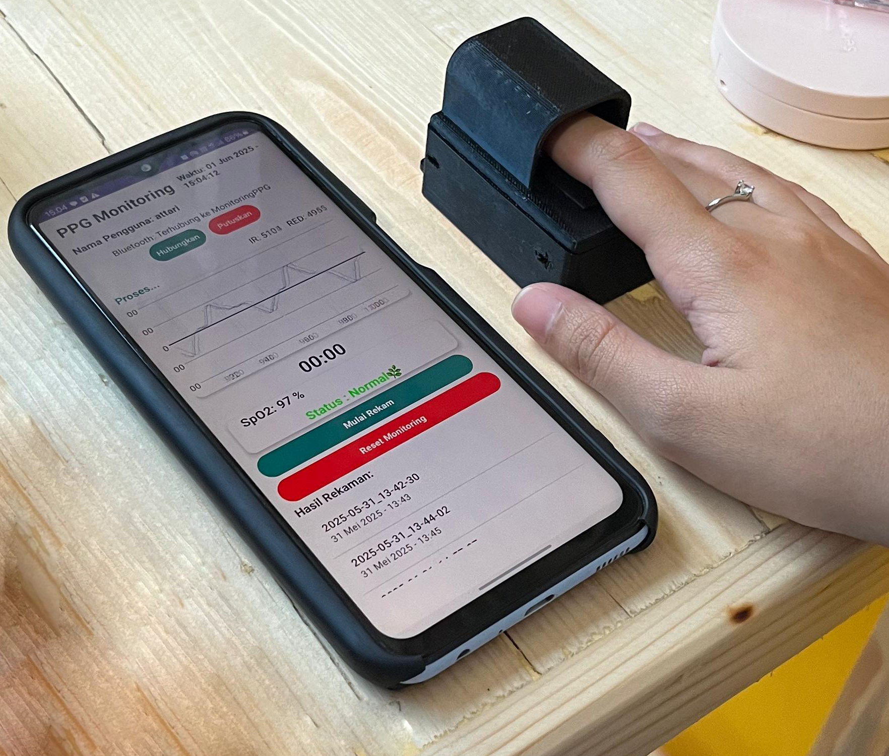

# 📟 Portable SpO₂ & PPG Monitoring System via BLE

A compact, portable health monitoring device that uses Photoplethysmography (PPG) to measure oxygen saturation (SpO₂), display real-time PPG waveforms, detect early hypoxia conditions, and store user data — all integrated into a custom Android application via Bluetooth Low Energy (BLE).

---

## 🚀 Features

- 📲 **Real-time SpO₂ Monitoring** via Bluetooth BLE
- 📉 **Live PPG Waveform Display**
- ⚠️ **Hypoxia Status Detection**:
  - Normal
  - Warning
  - At-Risk of Hypoxia
- 📁 **User Record System**:
  - In-app record list with timestamp
  - Save raw data to `.CSV`
  - Zoom, pause, and explore recorded data
- 👤 **Account System**:
  - Recording requires nickname login
  - Monitoring-only access available without account

---

## 🖼️ Visual Overview

### 📌 Wiring Diagram

### 📌 Component Position

### 📌 Device Prototype – Various Angles

### 📲 App Display – Realtime Monitoring
.jpg)
.jpg)
.jpg)

### 📊 App Display – Record Section
.jpg)
.jpg)

### 🧪 Filtered PPG Signal

### 👋 Device in Use

---

## 🔧 Hardware Components

- Wemos D1 ESP32 Mini
- MAX30102 PPG Sensor
- 2-Pin Switch
- USB Type-C Charger Module
- Li-Po Battery
- Custom 3D-printed or handmade enclosure (chassis)

---

## 💻 Software Stack

| Part       | Language | Description                        |
|------------|----------|------------------------------------|
| Device     | C++      | Arduino IDE sketch for data reading and BLE communication |
| Application| Kotlin   | Android app for monitoring, data visualization, and record management |

---

## 📡 System Architecture

- The **ESP32** reads PPG and SpO₂ data from the **MAX30102** sensor.
- Data is transmitted via **Bluetooth BLE** to a custom Android app.
- The app receives and visualizes the data in real time, processes hypoxia detection, and handles user data logging.
- The device has **no onboard display**, making the app the sole interface for viewing results.

---

## 📷 UI & Interaction Summary

- **Live Page**: Displays SpO₂ %, real-time PPG graph, and hypoxia status
- **Record Section**: Stores each session by user nickname (optional), shows list of past data, and enables exporting raw sensor values to `.csv`
- **Zoom & Pause**: Analyze recorded PPG waveforms in detail
- **No Account Needed**: For simple real-time monitoring
- **Login Required**: Only when saving records

---

## 🙏 Usage Notice

📌 **Note:**  
This project was created for educational and development purposes in the field of health monitoring systems.  
**Please do not plagiarize or copy without understanding.**  
If you wish to reuse, adapt, or expand upon this project, **please give proper credit to the creator: _Afriana Wardiman_**.

Feel free to study, modify, and develop it further in a responsible manner.

📩 For any questions regarding this device, you may contact:  
**afrianawardiman19@gmail.com**

---

## 📝 License

This project is open-source and available under the MIT License.  
See the [LICENSE](./LICENSE) file for more details.

---
